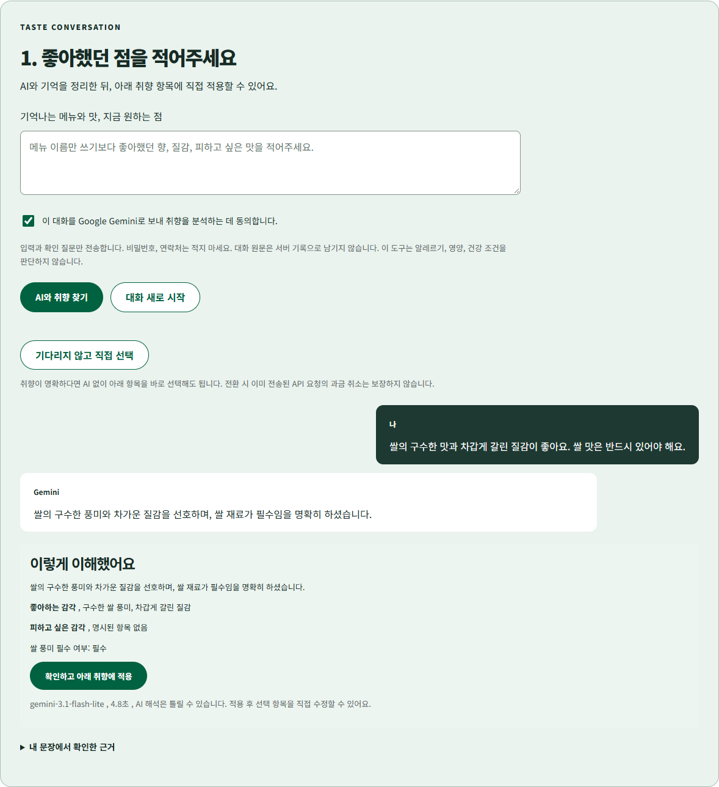
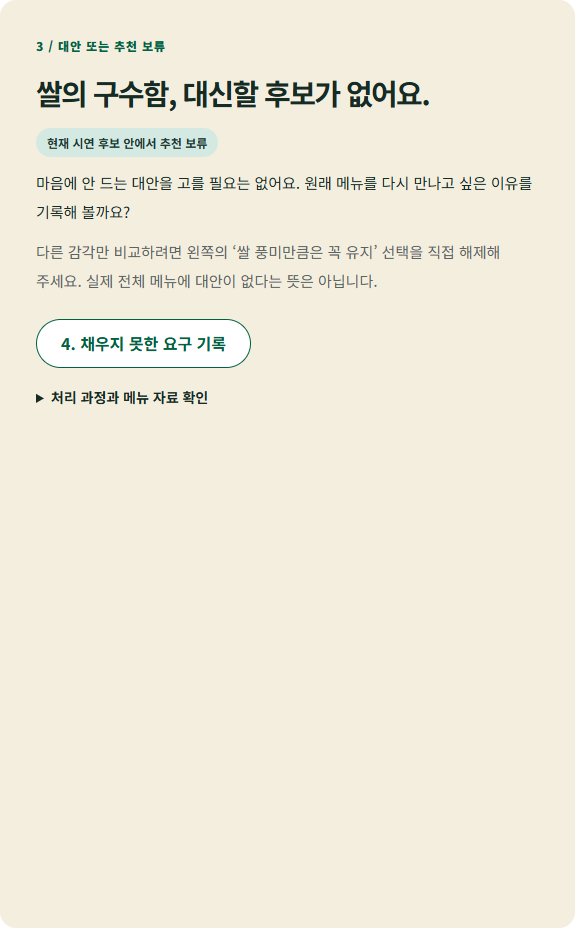
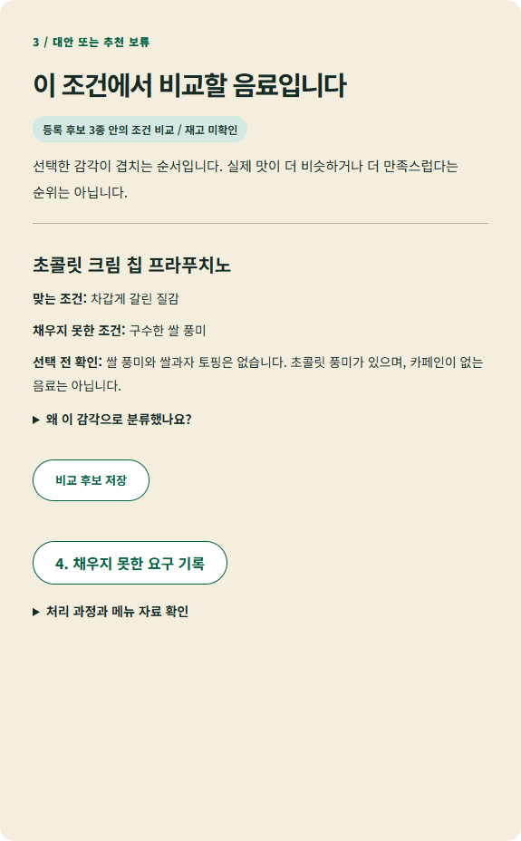
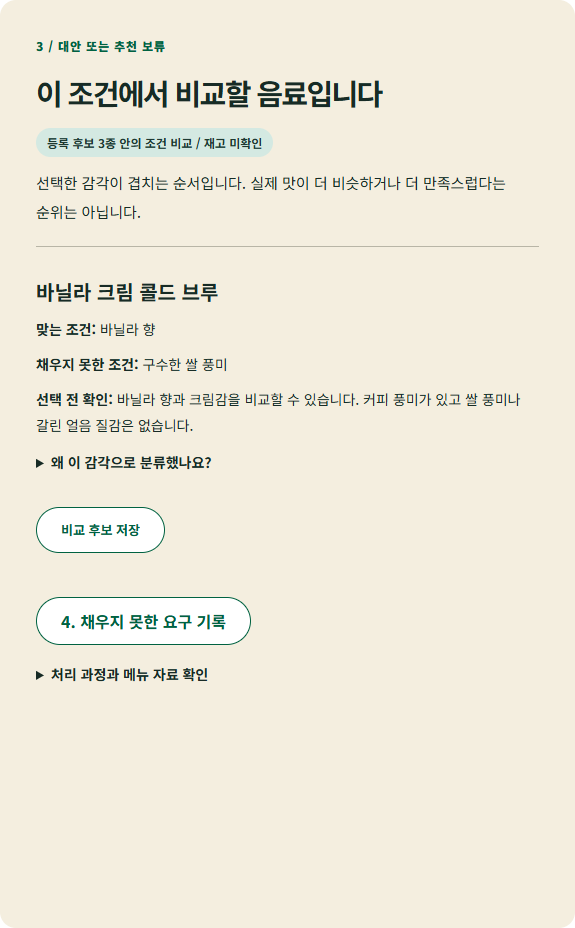

# 60초로 보는 NEXT CUP

아래 화면은 합성 입력을 사용한 브라우저 통합 시험입니다. 실제 Gemini 호출 1회를 포함하지만 외부 이용자 사용성 시험은 아닙니다.

## 1. 기억을 입력하고 AI 해석을 확인합니다

쌀의 구수함과 갈린 얼음 질감을 좋아하고 쌀이 필수라는 합성 조건입니다. 본인의 실제 경험에서 쌀이 필수였다고 단정한 것이 아닙니다.

## 2. 쌀이 필수라면 추천을 보류합니다

등록된 세 후보에는 쌀 풍미가 없습니다. 사용자 확인을 거친 뒤 빈 결과를 설명하고 남은 요구 기록으로 연결합니다.

## 3. 쌀 없이 다른 감각을 비교할 수도 있습니다

갈린 얼음 질감 선호, 커피 풍미 비선호라면 초콜릿 크림 칩이 후보입니다. 쌀 풍미는 충족하지 못한다고 표시합니다.

바닐라 향을 원하고 커피 풍미가 괜찮다면 바닐라 크림 콜드 브루를 비교할 수 있습니다.

## 4. 추천에서 남은 요구를 기록합니다

조건과 비교 후보를 이어받아 내용을 확인한 뒤 내 보관함에 저장합니다. 스타벅스 접수나 실제 주문이 아닙니다.

직접 확인: npm start → localhost:4322 → 직접 취향 선택 → 쌀 필수 여부 확인 → 후보 비교.
AI 키가 없어도 수동 비교는 가능합니다. [시험 기록](evidence/demo/ui-results.json)에는 시간 초과/늦은 응답 대응과 화면 크기 검사도 있습니다.
