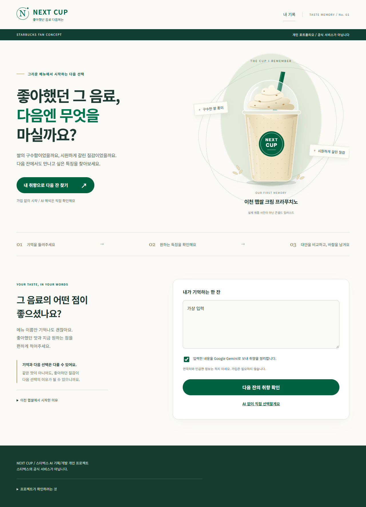
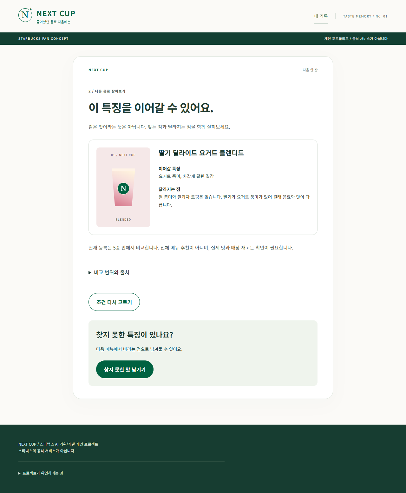
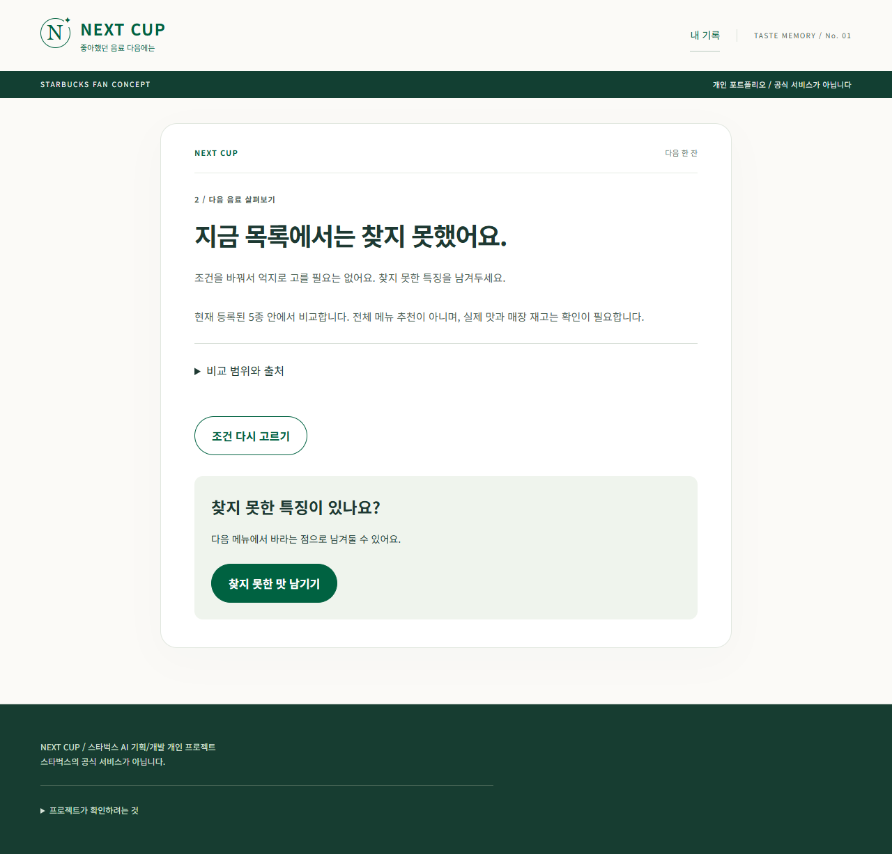

# 현재 화면 / v08

가입 없이 시작합니다. AI 키가 없어도 직접 선택할 수 있습니다.

## 1. 대안을 찾는 경우

실제 Gemini 연결 시험의 가상 입력:
“쌀은 없어도 괜찮아요. 차갑게 갈린 질감과 요거트 풍미가 좋아요. 초콜릿 풍미는 싫어요.”

AI 해석을 확인하고 요거트를 필수로 선택하면 딸기 딜라이트 요거트 블렌디드를 보여줍니다.
원래 맛과 같다는 뜻이 아니며 쌀 풍미와 토핑은 다르다고 안내합니다.

## 2. 추천을 보류하는 경우

“쌀의 구수한 풍미가 좋아요. 쌀 풍미는 꼭 있어야 해요.”
쌀 필수를 확인하면 현재 목록에서는 추천하지 않습니다.

## 3. AI 해석 뒤 조건을 바꾸는 경우

바닐라 입력으로 시작한 뒤 선호를 갈린 질감/과일로 바꾸고, 차/초콜릿을 피하도록 확인하면 바뀐 조건으로 비교합니다.
AI의 초기 해석에 사용자를 고정하지 않습니다.

## 4. 남은 요구

찾지 못한 특징을 내 기기에 저장합니다. 공개 게시/스타벅스 접수/실제 주문이 아닙니다.
