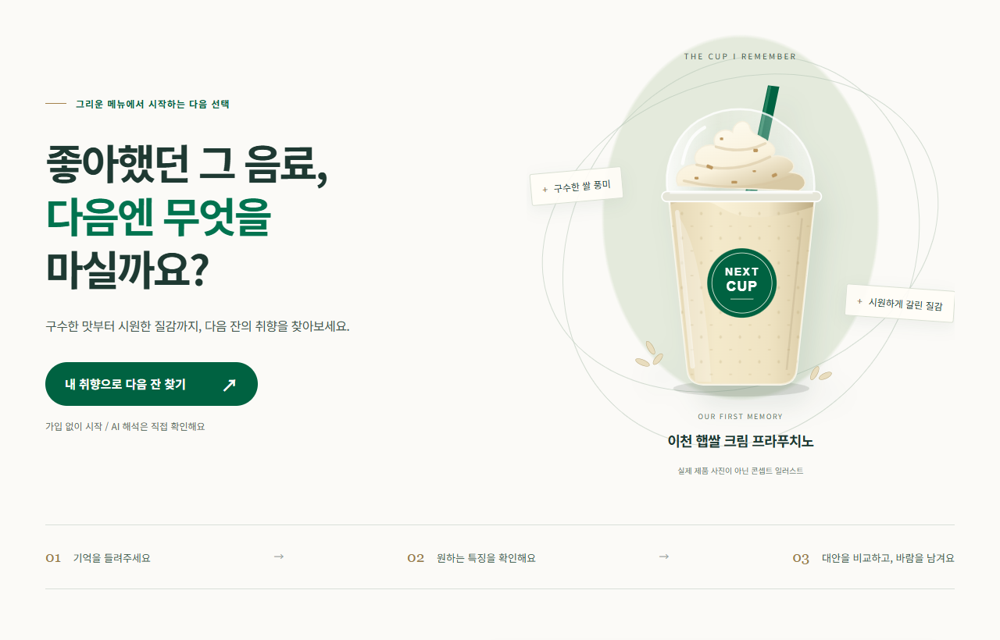

# NEXT CUP

좋아했던 음료의 특징으로 다음 잔을 찾고, 해결하지 못한 요구를 동의 기반 후속 알림으로 연결하는 시제품입니다.

[현재 제출 PDF](submission/NEXT-CUP-Portfolio-2026-10-08-v02.pdf) | [현재 검증 Excel](submission/NEXT-CUP-Evidence-2026-10-08-v02.xlsx) | [제출 자료 안내](submission/README.md) | [화면 설명](docs/DEMO.md)

스타벅스 AI 기획/개발 지원용 개인 프로젝트이며, 스타벅스 공식 서비스는 아닙니다.

## 소개

이천 햅쌀 크림 프라푸치노의 구수한 맛과 갈린 질감, 토핑을 좋아했던 경험에서 시작했습니다. 다음 음료를 고를 때 제품 이름만 찾기보다 기억에 남은 특징과 지금 꼭 필요한 조건을 구분하면 선택을 설명할 수 있다고 생각했습니다.

그래서 **AI가 취향을 정리하고, 사용자가 조건을 확인하고, 코드가 후보를 검사하는 구조**를 만들었습니다. 조건을 만족하는 음료가 없으면 추천을 보류하고 남은 요구를 기록합니다.

## 목차

- [사용 흐름](#사용-흐름)
- [추천과 후속 알림의 설계](#추천과-후속-알림의-설계)
- [검증 결과](#검증-결과)
- [실행과 검사](#실행과-검사)
- [문서와 코드 안내](#문서와-코드-안내)

## 사용 흐름

**기억 입력 → 취향 확인 → 후보 비교 또는 추천 보류 → 남은 요구 기록 → 알림 동의**

1. 좋아했던 음료의 특징을 적거나 AI 없이 조건을 직접 선택합니다.
2. Gemini가 정리한 맛과 질감, 피할 특징을 확인하고 수정합니다.
3. 필수 조건을 통과한 후보와 선택 근거를 비교합니다.
4. 만족하는 후보가 없으면 남은 요구를 브라우저에 기록합니다.
5. 관심 조건을 직접 선택해 후속 알림에 동의하거나 동의를 해제합니다.



## 추천과 후속 알림의 설계

| 판단 | 구현한 방식 |
|---|---|
| 취향 해석과 최종 선택의 구분 | AI는 문장을 조건으로 정리합니다. 최종 후보는 코드가 필수 조건과 제외 조건을 검사해 고릅니다. |
| 추천 보류 | 등록한 5종 중 쌀 풍미를 필수로 만족하는 후보는 없어 추천을 보류합니다. 비슷한 음료를 억지로 정답처럼 제시하지 않습니다. |
| 실패 후 계속 사용 | AI 연결이 실패해도 입력을 보존하고 직접 선택할 수 있게 합니다. |
| 후속 요구의 처리 | 가상 사례 9건으로 알림 동의, 조건 일치, 후속 검토와 시험 발송을 구분합니다. 중복 방지와 동의 해제도 확인합니다. |

같은 맛의 재현, 매장 재고 조회, 실제 주문은 지원하지 않습니다. 원격 알림의 실제 운영이나 이메일, 문자 발송도 이 시제품의 검증 범위에 포함하지 않습니다.

## 검증 결과

| 구분 | 확인한 범위 | 해석할 때의 한계 |
|---|---|---|
| 자동 검사 | 코드 125개, 기본 화면 14개, 후속 알림 화면 9개 | 기능 조건에 대한 검사이며 이용자 효과 측정은 아닙니다. |
| 실제 AI 연결 | 5종 목록의 연결 시험 4회, 최초 실패와 재실행 기록 보존 | 과거 3종 목록의 24회 시험과 조건이 달라 분리했습니다. |
| 직접 선택과 AI 비교 | 기존 실제 응답을 화면에 재생해 조건 변경 횟수 비교 | 입력, 읽기, 대기 시간을 제외해 시간 절감으로 해석하지 않습니다. |
| 공식 자료 예약 점검 | 2026년 10월 8일 첫 회차 완료. 9개 중 7개 기존 근거 유지, 2개 본문 확인 보류 | 본문 확인 실패를 판매 종료로 해석하지 않았고 추천 목록을 자동 변경하지 않았습니다. |
| 남은 검증 | 어려운 표현의 해석 평가, 외부 이용자 시험 | 연결 오류로 완료하지 못한 평가를 성공으로 계산하지 않습니다. |

실패 후 수정한 과정과 원자료는 [검증 기록](docs/VALIDATION.md), [AI 도입 판단](docs/AI-CHOICE.md), [오류 분석](docs/DECISIONS.md)에 있습니다.

## 실행과 검사

Node.js 24 이상에서 저장소 최상위 폴더의 터미널에 입력합니다. 기본 실행에는 별도 패키지 설치가 필요하지 않습니다.

```sh
npm start
```

http://127.0.0.1:4322 에서 ‘AI 없이 직접 선택할래요’를 사용할 수 있습니다. Gemini를 연결하려면 `.env.example`을 `.env`로 복사하고 본인 API 키(외부 서비스 인증값)를 설정합니다. 자세한 설정과 별도 실제 AI 시험은 [실행 안내](docs/HANDOFF.md)를 참고하세요.

```sh
npm ci
npx playwright install chromium
npm test
npm run test:browser
```

위 자동 검사는 가상 AI 응답과 임시 저장소를 사용합니다. 실제 AI 요청과 사용자 알림 발송은 하지 않습니다.

## 문서와 코드 안내

| 목적 | 위치 |
|---|---|
| 제품 범위와 직무 연결 | [기획서](docs/PRD.md), [직무 관련 설명](docs/CONTENT.md) |
| 직접 화면 확인 | [화면 설명](docs/DEMO.md), [사용자 시험 계획](docs/PROTOCOL.md) |
| 제출자료와 근거 | [제출 자료 안내](submission/README.md), [원자료 안내](evidence/README.md), [파일 확인값](submission/RELEASE.json) |
| 현재 구현 | [서버와 추천 코드](app/), [현재 화면](app/public/), [자동 검사](tests/) |

제작자가 문제와 기능 범위를 정하고 결과를 검토했습니다. Codex가 조사와 구현을 보조했고 Gemini는 취향 해석에 사용합니다. 키와 개인 입력 기록은 GitHub에 올리지 않습니다.
